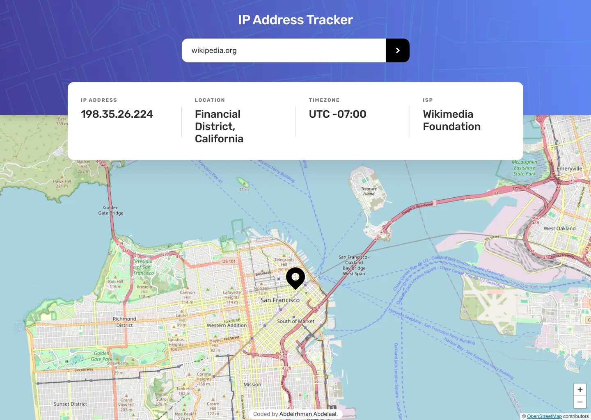

# IP Address Tracker

My solution to the [IP Address Tracker](https://www.frontendmentor.io/challenges/ip-address-tracker-I8-0yYAH0)
challenge on Frontend Mentor.

- Live: https://ip-address-tracker.abdelrhman-ahmed8881.workers.dev
- Code: https://github.com/MrBlackvanta/ip-address-tracker

## Built with

- Next.js 16, App Router
- React 19 and TypeScript
- Tailwind CSS v4

## Notes

## Author

- [LinkedIn](https://www.linkedin.com/in/abdelrhman-vanta/)
- [UpWork](https://www.upwork.com/freelancers/mrblackvanta)
- [Frontend Mentor](https://www.frontendmentor.io/profile/MrBlackvanta)
